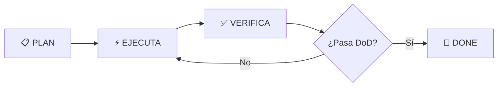

# 🤖 AGENTS.md — Protocolo Obligatorio para Agentes IA: Envíos DosRuedas

> **LEER COMPLETO ANTES DE TOCAR CUALQUIER ARCHIVO.**
> Este documento es el **contrato vinculante** entre el agente y el repositorio.
> Define qué hacer, cuándo hacerlo, cómo recuperarse de errores y qué NUNCA inventar.

---

## 📌 Contexto del Proyecto

| Campo | Valor |
|---|---|
| **Nombre** | Envíos DosRuedas |
| **Dominio** | Logística última milla, mensajería urbana, distribución E-Commerce |
| **Ubicación** | Mar del Plata, Argentina (Partido General Pueyrredón) |
| **Stack** | Next.js 16 (App Router, React 19, Turbopack) · TypeScript 5 strict · Tailwind CSS v4 (@theme) · Prisma ORM + PostgreSQL · pnpm |
| **Animaciones** | Framer Motion (`motion/react`) · GSAP |
| **Gestor de Paquetes** | **`pnpm` — único válido. NO usar `npm` ni `yarn`** |
| **Año Operativo** | **2026** (tarifas, fechas, referencias temporales) |
| **Identidad** | Empresa local, eficiente, confiable, 15+ años en calles de MDQ |

---

## 🗂️ Mapa de Archivos Críticos (Fuentes de Verdad)

**CUÁNDO LEER:** Antes de modificar lógica de negocio, tarifas, estilos, copys o arquitectura.

| Archivo | Propósito | Leer Obligatoriamente Antes De… |
|---|---|---|
| `docs/knowledge_base/contexto.md` | **Manifiesto central**: marca, valores, voz rioplatense, contexto MDQ 2026, reglas visuales inquebrantables | **CUALQUIER TAREA** — Es la constitución del proyecto |
| `docs/contexto/precios.md` | **Fuente de verdad de tarifas** — Filas exactas de BD `PricingRange` | Cambiar precios, tocar cotizadores, escribir copys con números |
| `src/lib/pricing.ts` | Funciones puras de cálculo Express y LowCost (validan `Math.ceil`) | Tocar lógica de precios, crear nuevos cotizadores |
| `prisma/schema.prisma` | Modelo de datos — Entidades `ServiceType`, `PricingRange`, `Order`, `Zone` | Migraciones, nuevos modelos, relaciones |
| `DESIGN.md` | Sistema de diseño completo (colores, tipografía, componentes, layout, a11y) | Crear/editar componentes UI, estilos globales, tokens |
| `src/app/globals.css` | Variables CSS, tokens de color, utilidades glow/sombra, `@theme` Tailwind v4 | Añadir/modificar estilos globales, nuevos tokens |
| `tailwind.config.ts` | Tokens: `brand-blue`, `brand-yellow`, fuentes, spacings | Extender design system |
| `PROJECT.md` | Arquitectura técnica, Roadmap con DoD, Milestones, Contracts de interfaz | Planificar trabajo nuevo, entender dependencias |
| `docs/contexto/errores-conocidos.md` | Gotchas: Turbopack Win, ESLint build, Prisma starter models, tests | Debuggear error recurrente |

---

## 🔄 Protocolo Iterativo Obligatorio (Plan → Ejecuta → Verifica → Itera)

**REGLA DE ORO:** *Ninguna tarea se marca "completed" sin verificación exhaustiva.*



### Pasos Detallados

| Fase | Acción | Evidencia Requerida |
|------|--------|---------------------|
| **1. PLAN** | Leer archivos críticos → Diseñar enfoque → Escribir plan en `TaskCreate` / `TodoList` | Plan escrito con archivos afectados y criterios DoD |
| **2. EJECUTA** | Cambios mínimos, atómicos, siguiendo DESIGN.md y AGENTS.md | Commits atómicos, sin `any`, Server Components por defecto |
| **3. VERIFICA** | **Obligatorio:** `pnpm build` (Win: `powershell -ExecutionPolicy Bypass -Command "pnpm build"`) + `pnpm run lint` + Tests relevantes | Output limpio, 0 errores TypeScript, 0 warnings ESLint |
| **4. ITERA** | Si falla → Corregir → Volver a VERIFICA. No saltar. | Loop hasta verde |

---

## 🛠️ Reglas de Código y Arquitectura

### TypeScript (Estricto Obligatorio)
- ❌ **Prohibido** `any` — usar `unknown` + type guard
- ✅ **Interfaces** para contratos de props públicas
- ✅ `type` solo para uniones, intersecciones, utilidades internas
- ✅ `strict: true` en `tsconfig.json` — no tocar

### Next.js 16 App Router (React 19)
- **Server Components por defecto**. Si no usa `useState`/`useEffect`/`useRef`/`motion`/`leaflet`/APIs browser → **NO** `'use client'`
- `'use client'` **solo** cuando el componente usa: hooks de cliente, `motion`, `leaflet`, WebSocket, `localStorage`, `IntersectionObserver`
- Rutas API en `src/app/api/`
- Server Actions para mutaciones (forms, webhooks)
- Edge Runtime para middleware auth/geo y API routes críticas

### Comandos del Proyecto (Solo `pnpm`)

| Acción | Comando |
|---|---|
| Desarrollo (default) | `pnpm dev` |
| Desarrollo sin Turbopack (Win hot-reload roto) | `pnpm dev --webpack` |
| **Build (Windows)** | `powershell -ExecutionPolicy Bypass -Command "pnpm build"` |
| Lint manual | `pnpm run lint` |
| Tests unitarios (Vitest) | `pnpm test` |
| Tests E2E (Playwright) | `pnpm test:e2e` |
| Sync BD | `pnpm prisma db push` |
| Generar cliente Prisma | `pnpm prisma generate` |
| Estudio BD | `pnpm prisma studio` |

> ⚠️ **Gotcha Windows:** Si cambios no se reflejan en navegador → `pnpm dev --webpack` (force polling)

---

## 💰 Reglas de Tarifas (CRÍTICO — NO INVENTAR VALORES)

**Cuándo aplica:** Toda modificación a cotizadores, `pricing.ts`, copys con precios, seed BD.

**Regla:** Las tarifas provienen **EXCLUSIVAMENTE** de `PricingRange` en BD. Ver `docs/contexto/precios.md`.

### Tabla de Precios Vigente 2026 (Fuente de Verdad)

| Servicio | Rango | Precio Base ARS |
|---|---|---|
| **EXPRESS** | 0–3 km | $3.700 |
| **EXPRESS** | 3–5 km | $4.600 |
| **EXPRESS** | 5–7 km | $6.100 |
| **EXPRESS** | 7–10 km | $8.200 |
| **EXPRESS** | +10 km | `Math.ceil(km) × $1.000` |
| **LOW_COST** | 0–3 km | $3.000 |
| **LOW_COST** | 3–5 km | $4.000 |
| **LOW_COST** | 5–7 km | $5.300 |
| **LOW_COST** | 7–10 km | $7.000 |
| **LOW_COST** | +10 km | `Math.ceil(km) × $700` |

> ⚠️ **`Math.ceil` OBLIGATORIO para tramos +10 km.** Se multiplican los kilómetros totales redondeados al entero superior por la tarifa unitaria por km (hasta el límite de 20 km).
> Ejemplo: `calculateExpressPrice(10.3) === 11000` (Math.ceil(10.3) = 11 km × $1.000)
> Ejemplo: `calculateExpressPrice(12) === 12000` (12 km × $1.000)

**Error de recuperación:** Si cotizador devuelve precio distinto a tabla → Verificar `src/lib/pricing.ts` → Verificar entidad `PricingRange` en BD → Verificar `docs/contexto/precios.md`.

---

## 🎨 Sistema de Diseño UI (Tailwind CSS v4) — LEY INQUEBRANTABLE

### ⚠️ REGLA FUNDAMENTAL: Paleta Exclusiva de 3 Colores
El sistema cromático usa **SOLO** Azul, Amarillo y Blanco (y sus escalas oficiales).
**PROHIBIDO** usar colores externos: `slate`, `gray`, `zinc`, `red`, `green`, `blue` (salvo tokens semánticos), hex inline.

Los tokens `gray-*`, `slate-*`, `zinc-*` están remapeados a escala de azul y **NO DEBEN USARSE DIRECTAMENTE**.

### Paleta Oficial — Usar Siempre Tokens, Nunca Hex Ad-hoc

| Token | Hex | Uso |
|---|---|---|
| `brand-blue-700` | `#0636A5` | **PRIMARY** — Header, Footer, secciones oscuras, textos principales |
| `brand-blue-500` | `#0950F6` | Botones activos, acentos interactivos |
| `brand-blue-50` | `#E6EEFE` | Fondos ultra claros, contenedores exteriores, outer bezel |
| `brand-yellow-500` | `#FFEC01` | **ACCENT / CTA OFICIAL** — Botones primarios, badges, señales alta prioridad |
| `brand-white-50` | `#FFFFFF` | **SUPERFICIE BASE** — Fondo páginas, núcleo tarjetas, formularios |
| `brand-ink` | `#00277C` | Texto cuerpo (más oscuro que blue-700) |

> ❌ **Prohibido:** `text-slate-*`, `bg-slate-*`, `text-gray-*`, `bg-gray-*`, hex inline (`#0636A5` en clase)
> ❌ **Prohibido:** `slate-900`, `slate-50`, `slate-600` — **NO EXISTEN** en paleta oficial
> ❌ **Prohibido ABSOLUTO — Auditoría Brand 2026-07-17:**
> - `green-500` / `green-400` en stepper vertical completed state → **Usar `brand-yellow-500`**
> - `green-500` / `green-400` en CTA WhatsApp → **Usar `brand-yellow-500`** (WhatsApp es marca externa, no color del sistema)
> - Logo rasterizado (`LogoEnviosDosRuedas.webp`) → **Solo `/public/logo-master.svg` vectorial**
> - Logo < 120px ancho → **Mínimo 120px (web) / 30mm (print)**

### Tipografía (Tokens Obligatorios)

| Token | Fuente | Usar Para |
|---|---|---|
| `font-display` | **Anton** | Títulos H1, H2 de impacto (signalética vial) |
| `font-subheading` | **Bebas Neue** | Subtítulos, badges, métricas, botones |
| `font-sans` | **Outfit + IBM Plex Sans** | Cuerpo, textos descriptivos, inputs |
| `font-mono` | **Geist Mono** | Métricas, precios, tracking numbers (`tabular-nums`) |

**Comportamiento:**
- `font-display` / `font-subheading`: **Uppercase obligatorio**, `letter-spacing` ajustado
- Labels/Badges: Uppercase, `tracking-wider`, `font-weight: 700`
- Mono: `font-variant-numeric: tabular-nums` siempre
- **Kinetic Font Stretch:** Elementos interactivos clave — `transform: scaleX(1.1)` + `letter-spacing: 0.02em` en hover

### Componentes — Contratos de Interfaz (Inmutables)

#### Double Bezel (Tarjetas/Bloques Principales)
```html
<!-- Outer -->
<div class="double-bezel-outer bg-brand-blue-50/80 border border-brand-blue-100 p-2 rounded-2xl">
  <!-- Inner -->
  <div class="double-bezel-inner bg-white p-6 rounded-xl border border-brand-blue-50/50 shadow-sm">
    <!-- Contenido real -->
  </div>
</div>
```
- **Outer:** `bg-brand-blue-50/80`, `border-brand-blue-100`, `rounded-2xl` (16px), `p-2` (8px), `shadow-float`
- **Inner:** `bg-white`, `rounded-xl` (12px), `shadow-inner`, `overflow-hidden`
- **Hover Outer:** `shadow-antigravity-deep`, `border-brand-blue-300`
- **Variante Dark (sobre fondo azul):** Outer mantiene `bg-brand-blue-50`/`border-brand-blue-100` por legibilidad

#### CTA Nested Pill (Botón Pastilla Anidada)
```html
<button class="cta-nested-pill bg-brand-yellow text-brand-blue">
  <span>Cotizar Envío</span>
  <span class="cta-nested-icon bg-brand-blue/10">→</span>
</button>
```

**Variantes:**

| Variante | Fondo | Texto | Borde | Icono (reposo) | Icono (hover) | Sombra |
|---|---|---|---|---|---|---|
| `--primary` | Yellow 500 | Blue 900 | — | Yellow 500 | `bg-brand-blue/10`, `text-brand-blue`, `translateX(4px)` | `shadow-accent-sm` → `shadow-cta-glow` |
| `--elevated` | White | Blue 700 | Blue 100 | `bg-brand-blue/10`, `text-brand-blue` | `bg-brand-blue`, `text-white`, `translateX(4px)` | `shadow-elevated` → `shadow-hover-lift` |
| `--outline` | Transparent | Blue 700 | Blue 700 | — | — | `bg-brand-blue-50` on hover |
| `--ghost` | Transparent | Blue 700 | Transparent | — | — | `bg-brand-blue-50` on hover |

**Reglas CTA:**
- `rounded-full`, `font-subheading`, `uppercase`, `tracking-[.05em]`, `font-weight: 700`
- Padding: `px-4 py-2` (compact) / `px-8 py-3` (large)
- Icono: `w-8 h-8` (32px), `rounded-full`, transition `transform + bg + color`
- **Active:** `scale-[.98] translateY(1px)` (primary) / `scale-[.98]` (elevated)
- **Focus-visible:** `ring-2 ring-brand-blue-500 ring-offset-2 ring-offset-white` (en azul: `ring-offset-brand-blue-700`)

#### Radio Card Group (Selector de Servicios)
- Grid 3 cols desktop, 1 col mobile
- Card: `bg-white`, `border-2 border-brand-blue-100`, `rounded-xl`, `p-6`
- **Checked Express:** `bg-brand-blue-700`, `border-brand-blue-700`, `text-white`
- **Checked LowCost:** `bg-brand-blue-50`, `border-brand-blue-200`, `text-brand-blue-700`
- **Checked Flex:** `bg-brand-yellow-50`, `border-brand-yellow-200`, `text-brand-blue-700`
- Icon box: `w-12 h-12` (48px), `rounded-xl`, fondo según variante
- Focus-visible: `ring-2 ring-brand-blue-500 ring-offset-2 ring-offset-white`

#### Input Fields
```html
<div class="input-wrapper">
  <label class="input-label">ORIGEN</label>
  <div style="position:relative">
    <svg class="input-icon">...</svg>
    <input class="input-field" placeholder="Calle 123" aria-invalid="false">
  </div>
</div>
```
- `h-11` (44px), `border-2 border-brand-blue-100`, `rounded-xl`, `pl-10` (espacio icono)
- **Hover:** `border-brand-blue-200`
- **Focus:** `border-brand-blue-700` + `ring-2 ring-brand-blue-500/20`
- **Error:** `border-red-500` + `ring-2 ring-red-500/20`
- **Disabled:** `border-brand-blue-100`, `bg-brand-blue-50/50`, `cursor-not-allowed`
- Label: `font-subheading`, `text-label`, `uppercase`, `tracking-[.05em]`
- Help text: `font-mono`, `10px`, `text-brand-blue-400`

#### Steppers
**Horizontal (Cotizador):**
- Línea horizontal 2px `brand-blue-100` (completed: `brand-yellow-500`)
- Círculos 40px: completed=`yellow-500`, active=`blue-700` + ring, pending=`blue-100`
- Labels: `font-subheading`, `text-label`, `uppercase`

**Vertical (How It Works):**
- Línea vertical 2px izquierda `brand-blue-100`
- Dots 24px con border blanco 3px
- Completed: `brand-yellow-500` + `brand-yellow-100` ring — **NUNCA `green-500`**
- Active: `brand-yellow-500` + `brand-yellow-500/30` ring + `pulse-subtle`
- Pending: `brand-blue-100`
- Números: `font-display`, `text-h2`

#### Logos Carousel (Infinite Scroll)
- `mask-image: linear-gradient(to right, transparent, black 10%, black 90%, transparent)`
- Track: `flex`, `gap: var(--space-12)` (48px), `animation: logos-scroll 30s linear infinite`
- Items: `h-12` (48px), `grayscale(100%) contrast(1.2) opacity-60`
- **Hover/Focus:** `grayscale(0) contrast(1) opacity-100`
- **Pausa:** hover, focusin, `document.hidden`

#### Float / Tilt Card (Hero 3D Cards)
- `transform-style: preserve-3d`
- `perspective: 1000px` en contenedor
- Mousemove → `rotateX(±8deg) rotateY(±8deg)` con lerp 0.1
- Hover: `translateY(-6px) rotateX(4deg) rotateY(-2deg)` + `shadow-antigravity-deep`
- Capas con `translateZ`: 10px, 40px, 70px, 80px para profundidad

#### Asymmetric Bento Grid (Servicios)
- Base: `grid-cols-12`, `gap-6 lg:gap-8`, `auto-rows-[380px]`
- **Span 7** (Hero cards): Express, E-Commerce 3PL — `lg:col-span-7`
- **Span 5** (Standard cards): LowCost, Flex — `lg:col-span-5`
- **Span 12** (Full width): Cotizador CTA — `col-span-12`
- Mobile: todas `col-span-1` (`grid-cols-1`)
- Tablet: `grid-cols-2` (pares)

#### Vertical Stepper (How It Works)
- Línea vertical 2px izquierda `brand-blue-100`
- Items: `flex gap-6`, dot 24px fixed left
- Content: número (Display), título (Display), desc (Body)
- **Completed:** `brand-yellow-500` + `brand-yellow-100` ring — **NUNCA `green-500`**
- **Active:** `brand-yellow-500` + `brand-yellow-500/30` ring + `pulse-subtle`
- **Pending:** `brand-blue-100`
- Números: `font-display`, `text-h2`

#### Logos Carousel (Infinite Scroll)
- `mask-image: linear-gradient(to right, transparent, black 10%, black 90%, transparent)`
- Track: `flex`, `gap: var(--space-12)` (48px), `animation: logos-scroll 30s linear infinite`
- Items: `h-12` (48px), `grayscale(100%) contrast(1.2) opacity-60`
- **Hover/Focus:** `grayscale(0) contrast(1) opacity-100`
- **Pausa obligatoria:** hover, focusin, `document.hidden` (accesibilidad)

#### WhatsApp CTA — Regla de Marca Externa
| Elemento | ✅ Correcto (Nuestra Marca) | ❌ Prohibido (Marca Externa) |
|----------|----------------------------|------------------------------|
| **Background** | `brand-yellow-500` | `green-500`, `green-600` |
| **Hover** | `brand-yellow-400` | `green-400` |
| **Icono** | SVG blanco sobre amarillo marca | Verde WhatsApp como fondo |

> **Rationale:** WhatsApp green es referencia de marca externa **solo para el icono**. Nuestro CTA background **siempre** usa `brand-yellow-500` para coherencia de marca.

---

## 🗺️ Estructura del Código (Actualizada)

```
src/
├── app/                           # Rutas Next.js App Router
│   ├── api/                       # Endpoints API (Server Actions + Edge)
│   ├── cotizar/
│   │   ├── express/page.tsx       # Cotizador Express + Mapa Leaflet
│   │   └── lowcost/page.tsx       # Cotizador LowCost + Planilla masiva
│   ├── servicios/                 # Páginas informativas servicios
│   │   ├── express/page.tsx
│   │   ├── lowcost/page.tsx
│   │   ├── flex/page.tsx
│   │   ├── 3pl/page.tsx
│   │   └── emprendedores/page.tsx
│   ├── nosotros/
│   │   ├── sobre-nosotros/page.tsx
│   │   ├── preguntas-frecuentes/page.tsx
│   │   └── nuestras-redes/page.tsx
│   ├── contacto/page.tsx
│   ├── ayuda/page.tsx             # Centro de Ayuda / FAQ Global
│   └── layout.tsx                 # Root layout + providers
├── components/
│   ├── cotizar/
│   │   ├── express/               # CotizadorExpressHero, CotizadorExpressForm, LeafletMap
│   │   └── lowcost/               # CotizadorLowCostHero, CotizadorLowCostForm, BatchGrid
│   ├── ui/                        # Componentes base compartidos
│   │   ├── AddressAutocomplete.tsx
│   │   ├── DoubleBezelCard.tsx
│   │   ├── CTANestedPill.tsx
│   │   ├── RadioCardGroup.tsx
│   │   ├── InputField.tsx
│   │   ├── StepperHorizontal.tsx
│   │   ├── StepperVertical.tsx
│   │   ├── LogosCarousel.tsx
│   │   ├── FloatTiltCard.tsx
│   │   ├── BentoGrid.tsx
│   │   ├── Badge.tsx
│   │   ├── Toast.tsx
│   │   └── index.ts               # Barrel exports
│   ├── layout/                    # Header, Footer, MobileNav, CarruselRedes
│   └── home/                      # HeroAnimado, VisionSection, TrustBar, SocialProof
├── hooks/
│   ├── useOSRMRoute.ts            # Cálculo rutas reales vía OSRM
│   ├── useGeocode.ts              # Autocomplete direcciones MDQ
│   └── useIntersectionObserver.ts # Reveals, counters
├── lib/
│   ├── pricing.ts                 # Funciones puras tarifas (fuente de verdad lógica)
│   ├── prisma.ts                  # Cliente Prisma singleton
│   ├── utils.ts                   # Helpers: cn(), formatARS(), clamp(), etc.
│   └── validations.ts             # Zod schemas (forms, webhooks)
└── types/
    ├── pricing.ts                 # Tipos ServiceType, PricingRange, QuoteResult
    ├── order.ts                   # Order, TrackingEvent, Zone
    └── globals.d.ts               # Augmentaciones globales
```

---

## 🗣️ Tono de Voz y Contenido (OBLIGATORIO)

**Cuándo aplica:** Al redactar **cualquier** copy, label, mensaje, tooltip, placeholder, texto de chatbot, email, notificación.

### 1. Voseo Rioplatense Obligatorio
- ✅ "Vos elegís", "Ingresá tus datos", "Contactanos", "Calculá tu envío", "Rastreá tu paquete"
- ✅ "Tu logística", "Tu envío", "Te avisamos", "Quedate tranquilo"
- ❌ "Usted elige", "Ingrese sus datos", "Contáctenos", "Calcule su envío", "Rastree su paquete"
- ❌ "Su logística", "Su envío", "Le avisamos", "Quédese tranquilo"

### 2. Geolocalización Obligatoria (Mar del Plata)
Ejemplos/simulaciones **DEBEN** referenciar zonas reales:
- "Zona Güemes", "Centro de Distribución", "Constitución", "Puerto"
- "Friuli 1972", "Playa Grande", "Punta Mogotes", "Chauvín", "Batán", "Camet"

### 3. Año de Referencia
- **2026** en toda mención a tarifas, vigencia, fechas operativas

### 4. Marcadores Pendientes
- Buscar y reemplazar `TODO MDQ` en código por contenido local definitivo

### 5. Verbos de Acción (Copy UI)
| Acción | Verbo Correcto |
|---|---|
| Cotizar | **Cotizá** |
| Enviar | **Enviá** |
| Rastrear | **Rastreá** |
| Contactar | **Contactanos** |
| Ingresar | **Ingresá** |
| Elegir | **Elegí** |
| Ver | **Mirá** |
| Esperar | **Esperá** |

---

## 🤖 Flujo Multi-Agente (`.agents/`)

El proyecto cuenta con agentes especializados en `.agents/`. Consultar antes de ejecutar tareas complejas.

| Rol | Directorio | Responsabilidad |
|---|---|---|
| **Orchestrator** | `.agents/orchestrator/` | Coordina flujo general |
| **Explorer** | `.agents/explorer_*/` | Análisis y relevamiento de páginas |
| **Worker** | `.agents/worker_*/` | Implementación de cambios |
| **Reviewer** | `.agents/reviewer_*/` | Revisión calidad y diseño |
| **Auditor** | `.agents/auditor_*/` | Verificación contra DESIGN.md |
| **Challenger** | `.agents/challenger_*/` | Tests adversariales de UI |
| **Sentinel** | `.agents/sentinel/` | Guardia de contratos de interfaz |

**Skills del proyecto** en `.agents/skills/` — consultar antes de tareas de diseño, stitch, generación de imágenes.

---

## 📸 Prompts de Imágenes (Nano Banana MCP)

**Cuándo usar:** Al generar imágenes para el sitio mediante skill `nanobanana`.

### Estructura 1 — Imagen Nueva
```
[Sujeto y descripción detallada] + [Estilo artístico/visual] + [Composición/Ángulo] + [Iluminación y atmósfera] + [Paleta: #00277c, #FFEC01, #0636A5]
```

### Estructura 2 — Con Referencia (logos, personajes, estilo)
```
[Acción/Transformación] + [Referencia específica] + [Cambios o integración] + [Contexto entorno Mar del Plata] + [Consistencia brand: Egyptian Blue + Amarillo]
```

**Directrices completas:** `docs/directrices_imagenes.md`

---

## ✅ Checklist de "Terminado" (Definition of Done por Tarea)

**ANTES de marcar cualquier tarea como `completed`, verificar TODOS:**

- [ ] Componentes usan tokens Tailwind (`bg-brand-blue-700`), **NUNCA** hex inline
- [ ] **Double Bezel** aplicado en tarjetas principales (secciones blancas)
- [ ] Tipografía respeta jerarquía `font-display` / `font-subheading` / `font-sans`
- [ ] **Textos en voseo rioplatense** + referencias Mar del Plata
- [ ] **Proyecto compila:** `powershell -ExecutionPolicy Bypass -Command "pnpm build"` ✅
- [ ] **Lint pasa:** `pnpm run lint` ejecutado manualmente ✅
- [ ] **Precios cotizados** coinciden **EXACTAMENTE** con tabla tarifas 2026
- [ ] Si cambios en `schema.prisma`: `pnpm prisma generate` ejecutado
- [ ] **No valores `any`** en TypeScript
- [ ] **Responsive verificado:** 320px, 768px, 1024px, 1280px, 1920px
- [ ] **A11y:** focus-visible rings, skip link, heading structure, alt text, contrast AA
- [ ] **Touch targets** ≥ 44×44px (botones, links, inputs)
- [ ] **Performance:** Lighthouse ≥ 90 (Next.js 16, images optimizadas, lazy load)

---

## ⚠️ Errores Conocidos y Recuperación

| Error | Causa | Workaround / Fix |
|---|---|---|
| Hot-reload no funciona en Windows | Bug Turbopack | `pnpm dev --webpack` (force polling) |
| Build falla por ESLint | Config estricta | Correr `pnpm run lint` antes; build ignora ESLint por config |
| Modelos `User`/`Post` en Prisma | Starter models no eliminados | Ignorarlos; modelos productivos: `ServiceType`, `PricingRange`, `Order`, `Zone` |
| Precio incorrecto en cotizador | Lógica excedente sin `Math.ceil` | Verificar `src/lib/pricing.ts` línea km adicional |
| Componente sin `'use client'` falla | Hook React en Server Component | Agregar `'use client'` al inicio del archivo |
| Leaflet CSS no carga | Import order | Importar `leaflet/dist/leaflet.css` en layout o componente padre |
| Animación Framer Motion no inicia | SSR hydration | Usar `useEffect` + `isMounted` o `whileInView` con `once: true` |

---

## 📋 Referencia Rápida: Archivos a Leer Antes de Cada Tipo de Tarea

| Tipo de Tarea | Archivos Obligatorios |
|---|---|
| **Nuevo componente UI** | `DESIGN.md` (Component Architecture), `src/app/globals.css`, `tailwind.config.ts` |
| **Lógica precios / cotizador** | `docs/contexto/precios.md`, `src/lib/pricing.ts`, `prisma/schema.prisma` |
| **Copy / contenido** | `docs/knowledge_base/contexto.md` (Sección Voz), `AGENTS.md` (Tono) |
| **Nueva página / ruta** | `PROJECT.md` (Roadmap, DoD), `DESIGN.md` (Layout Principles, Section Structure) |
| **Migración BD / modelo** | `prisma/schema.prisma`, `docs/contexto/arquitectura.md`, `docs/contexto/decisiones.md` |
| **Debug / error raro** | `docs/contexto/errores-conocidos.md`, `AGENTS.md` (Errores Conocidos) |
| **Imagen / asset visual** | `docs/directrices_imagenes.md`, `DESIGN.md` (Color Palette, Logotipo inalterable) |
| **Configuración build / lint** | `next.config.ts`, `eslint.config.mjs`, `tsconfig.json`, `pnpm-workspace.yaml` |

---

*Última actualización: 2026-07-20 | Versión: 2.0 | Próxima revisión: Al cambio de stack, marca o tarifas*