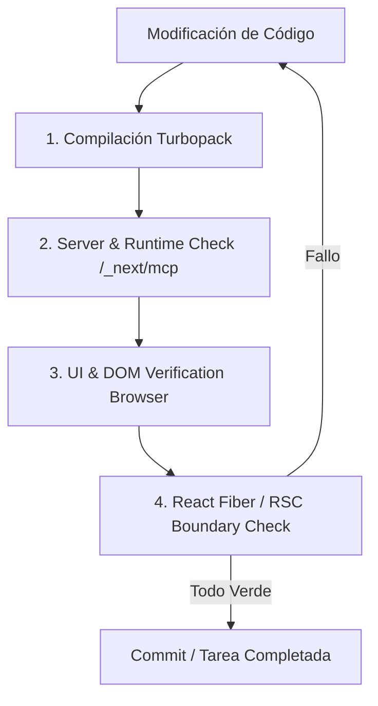

# 🚀 Guía Definitiva de Mejores Prácticas y Flujo de Desarrollo (Next.js 16 + React 19)

> **Proyecto:** Envíos DosRuedas (Mar del Plata, 2026)  
> **Stack:** Next.js 16 (Turbopack, App Router) · React 19 · TypeScript 5 (Strict) · Tailwind CSS v4 · Prisma ORM · Framer Motion / GSAP · pnpm

---

## 📑 Tabla de Contenidos
1. [Ciclo de Desarrollo e Introspección en Tiempo Real (next-dev-loop)](#1-ciclo-de-desarrollo-e-introspección-en-tiempo-real-next-dev-loop)
2. [Arquitectura App Router y React 19 (RSC vs RCC)](#2-arquitectura-app-router-y-react-19-rsc-vs-rcc)
3. [TypeScript Estricto y Modelado de Datos](#3-typescript-estricto-y-modelado-de-datos)
4. [Design System & Tailwind CSS v4 (Reglas Inquebrantables)](#4-design-system--tailwind-css-v4-reglas-inquebrantables)
5. [Lógica de Negocio y Tarifas (Fuente de Verdad)](#5-lógica-de-negocio-y-tarifas-fuente-de-verdad)
6. [Tono de Voz y Geolocalización (MDQ)](#6-tono-de-voz-y-geolocalización-mdq)
7. [Testing, Calidad y CI/CD](#7-testing-calidad-y-cicd)
8. [Base de Datos y Prisma ORM](#8-base-de-datos-y-prisma-orm)
9. [Checklist de Verificación (Definition of Done)](#9-checklist-de-verificación-definition-of-done)
10. [Optimización y Despliegue en Vercel (Edge, Caching, Bundle & Observabilidad)](#10-optimización-y-despliegue-en-vercel-edge-caching-bundle--observabilidad)

---

## 1. Ciclo de Desarrollo e Introspección en Tiempo Real (next-dev-loop)

El ritmo de trabajo no se limita a que TypeScript o el linter compilen; **se valida en tiempo de ejecución**.



### Protocolo de 4 Vistas Cruzadas:
1. **Compila sin issues:** Consulta `get_compilation_issues` en Turbopack.
2. **Ejecuta sin errores de servidor:** Verificación en `/_next/mcp` (`get_errors`, `get_logs`).
3. **Comportamiento visual interactivo:** Pruebas DOM reales con DevTools / `agent-browser` (estados hover, animaciones, navegación).
4. **Inspección de árbol React:** Verificación de re-renders innecesarios, boundaries de Suspense y límites cliente/servidor.

---

## 2. Arquitectura App Router y React 19 (RSC vs RCC)

### 🔹 Server Components por Defecto
- Todas las páginas (`page.tsx`), layouts (`layout.tsx`) y componentes estructurales deben ser **React Server Components (RSC)**.
- **Ventajas:** Cero peso en bundle JS cliente, acceso directo a base de datos/backend, streaming out-of-the-box con `<Suspense>`.

### 🔹 Reglas para `'use client'`
Usar la directiva `'use client'` **únicamente** cuando el componente requiera:
- Hooks de estado o ciclo de vida: `useState`, `useReducer`, `useEffect`, `useRef`, `useId`.
- Event handlers directos en el DOM: `onClick`, `onChange`, `onSubmit` (cuando no son Server Actions).
- Animaciones del lado del cliente: `motion/react` (Framer Motion), GSAP ScrollTrigger.
- Bibliotecas interactivas del browser: Mapas Leaflet, TSParticles, WebSockets, `localStorage`.
- Consumo de Context Providers de React.

### 🔹 Server Actions y Mutaciones
- Ubicadas en `src/app/api/` o declaradas con `'use server'`.
- **Validación obligatoria:** Todo input debe ser validado con esquemas **Zod** antes de tocar base de datos o lógica de cotización.
- Retornar siempre objetos tipados (`{ success: true, data }` o `{ success: false, error }`).

---

## 3. TypeScript Estricto y Modelado de Datos

- **Prohibición Total de `any`:** Si el tipo es dinámico o desconocido, usar `unknown` combinado con type guards o validadores Zod.
- **Interfaces vs Types:**
  - `interface` para contratos de props públicas y entidades reutilizables.
  - `type` para uniones de tipos, tuplas, utilidades computadas o tipos auxiliares de estado.
- **Tipado en Formularios:** Uso de `react-hook-form` con `@hookform/resolvers/zod` para inferencia automática de tipos (`z.infer<typeof FormSchema>`).

---

## 4. Design System & Tailwind CSS v4 (Reglas Inquebrantables)

### 🎨 Paleta Cromática Restringida (Regla de 3 Colores)
El proyecto utiliza **únicamente** Azul, Amarillo y Blanco (y sus variantes oficiales).

| Token | Hex | Propósito |
|---|---|---|
| `brand-blue-700` | `#0636A5` | Primario: Encabezados, footer, fondos oscuros, textos de alta jerarquía |
| `brand-blue-500` | `#0950F6` | Interacción activa, enlaces, botones secundarios |
| `brand-blue-50` | `#E6EEFE` | Fondos claros, superficies externas, outer bezels |
| `brand-yellow-500`| `#FFEC01` | **Acento / CTA Oficial**: Botones primarios, badges, highlights |
| `brand-white-50` | `#FFFFFF` | Fondo base, tarjetas interiores, formularios |
| `brand-ink` | `#00277C` | Texto de cuerpo y alta legibilidad |

> 🚫 **Prohibido:** Clases `text-slate-*`, `bg-gray-*`, `text-zinc-*`, hexadécimales inline o botones verdes (incluso para WhatsApp, el botón debe ser amarillo con icono blanco/azul).

### 🧩 Componentes de Diseño Clave
1. **Double Bezel:**
   - Exterior: `bg-brand-blue-50/80 border border-brand-blue-100 rounded-2xl p-2`
   - Interior: `bg-white rounded-xl border border-brand-blue-50/50 p-6 shadow-sm`
2. **CTA Nested Pill:**
   - Botón redondeado `rounded-full` con pastilla de icono anidada con microanimación de traslación en hover.
3. **Tipografía:**
   - `font-display` (Anton) para H1 y H2 de gran impacto.
   - `font-subheading` (Bebas Neue) para badges, subtítulos y botones en mayúsculas.
   - `font-sans` (Outfit / IBM Plex Sans) para lectura fluida.
   - `font-mono` (Geist Mono) para números tabulares, precios y tracking.

---

## 5. Lógica de Negocio y Tarifas (Fuente de Verdad)

Las tarifas se calculan exclusivamente mediante `src/lib/pricing.ts` basándose en las bandas oficiales 2026.

### Tabla Tarifaria Vigente 2026

| Servicio | Rango | Tarifa Base ARS | Regla Excedente (+10 km) |
|---|---|---|---|
| **EXPRESS** | 0–3 km | $3.700 | — |
| **EXPRESS** | 3–5 km | $4.600 | — |
| **EXPRESS** | 5–7 km | $6.100 | — |
| **EXPRESS** | 7–10 km | $8.200 | — |
| **EXPRESS** | +10 km | $8.200 | `+ Math.ceil(km − 10) * 1000` |
| **LOW_COST** | 0–3 km | $3.000 | — |
| **LOW_COST** | 3–5 km | $4.000 | — |
| **LOW_COST** | 5–7 km | $5.300 | — |
| **LOW_COST** | 7–10 km | $7.000 | — |
| **LOW_COST** | +10 km | $7.000 | `+ Math.ceil(km − 10) * 700` |

> ⚠️ **Regla Crítica:** En el excedente de 10 km es obligatorio usar `Math.ceil()`. Ejemplo: 10.2 km computa como 1 km adicional completo.

---

## 6. Tono de Voz y Geolocalización (MDQ)

- **Voseo Rioplatense:** "Cotizá", "Calculá", "Elegí", "Rastreá tu paquete", "Contactanos".
- **Identidad Marplatense:** Menciones contextuales de barrios reales: *Güemes, Centro, Chauvín, Playa Grande, Punta Mogotes, Constitución, Puerto, Batán, Camet*.
- **Año de Referencia:** Siempre **2026**.

---

## 7. Testing, Calidad y CI/CD

### Comandos de Verificación
```bash
# Comprobación de tipos en todo el proyecto
pnpm typecheck

# Lint estricto de código
pnpm run lint

# Tests unitarios con Vitest
pnpm test

# Build de producción optimizado
powershell -ExecutionPolicy Bypass -Command "pnpm build"
```

### Reglas de Calidad:
- Cero advertencias críticas o errores en el build.
- Touch targets móviles $\ge 44 \times 44\text{ px}$.
- Cumplimiento de accesibilidad WCAG AA (contraste de color adecuado, atributos `aria-*` y etiquetas `<label>` vinculadas con inputs).

---

## 8. Base de Datos y Prisma ORM

- Cliente singleton en `src/lib/prisma.ts` para evitar saturación de conexiones en entornos de desarrollo y serverless.
- Modelos principales: `ServiceType`, `PricingRange`, `Order`, `Zone`.
- Cada cambio en `prisma/schema.prisma` debe acompañarse de `pnpm prisma generate` y `pnpm prisma db push`.

---

## 9. Checklist de Verificación (Definition of Done)

Antes de dar por finalizado un cambio, validar:
- [ ] ¿Los componentes usan las clases y tokens del sistema de diseño (sin colores externos ni hex inline)?
- [ ] ¿Los títulos y botones respetan la jerarquía tipográfica (`font-display`, `font-subheading`)?
- [ ] ¿Los textos están en voseo rioplatense y ambientados en Mar del Plata (2026)?
- [ ] ¿Las cotizaciones utilizan `calculateExpressPrice` / `calculateLowCostPrice` con `Math.ceil` para el excedente?
- [ ] ¿`pnpm typecheck` pasa con 0 errores?
- [ ] ¿`pnpm run lint` pasa sin advertencias?
- [ ] ¿`pnpm build` compila limpiamente en Turbopack?
- [ ] ¿El flujo visual y de interacción fue verificado en el navegador?

---

## 10. Optimización y Despliegue en Vercel (Edge, Caching, Bundle & Observabilidad)

### ⚡ 1. Optimización de Assets e Imágenes en Vercel Edge
- **Formatos Modernos:** Servir siempre AVIF y WebP (`formats: ['image/avif', 'image/webp']`).
- **Caché Extendida de Imágenes:** `minimumCacheTTL: 2592000` (30 días) para evitar re-transformaciones costosas y llamadas redundantes a Vercel Image Optimization.
- **Inmutabilidad de Estáticos:** Cabecera `Cache-Control: public, max-age=31536000, immutable` para `/images/*`, `/fonts/*` y `/_next/static/*`.

### 📦 2. Reducción de Bundle y Tree Shaking
- **`optimizePackageImports` en `next.config.ts`:**
  - `lucide-react`, `react-icons`, `@radix-ui/*`, `@number-flow/react`, `motion`, `clsx`, `tailwind-merge`, `zod`.
  - Asegura que solo se incluyan en el cliente los símbolos y módulos efectivamente utilizados, reduciendo radicalmente el First Load JS.

### 🛡️ 3. Cabeceras de Seguridad y Red Edge
- **HSTS:** `Strict-Transport-Security: max-age=63072000; includeSubDomains; preload`
- **Prefetch DNS:** `X-DNS-Prefetch-Control: on`
- **Protección contra Framing & Sniffing:** `X-Frame-Options: SAMEORIGIN` y `X-Content-Type-Options: nosniff`.

### 🗄️ 4. Conectividad PostgreSQL Serverless (Vercel Functions / Fluid Compute)
- Uso de `PrismaPg` adapter con singleton global para reusar pools de conexiones TCP y evitar el agotamiento de sockets de base de datos en ejecuciones serverless concurrentes.
- Timeout de funciones calibrado para respuestas sub-segundo en APIs de cotización y geocodificación.

