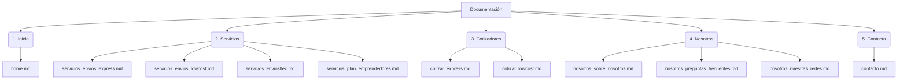

# Mapa de la Documentación - Envíos DosRuedas

Este documento sirve como guía interactiva para navegar por la documentación del sitio web de **Envíos DosRuedas**. A continuación se detalla el contenido disponible en cada archivo de documentación (`.md`) y la ubicación de la información agrupada por secciones lógicas.

---

## 🗺️ Estructura de Secciones y Contenidos

---

### 1. 🏠 Inicio (Página Principal)

*   **Archivo:** [home.md](file:///e:/proyectos/02enviosdosruedashector/docs/home.md)
*   **Propósito:** Página de aterrizaje principal que consolida la propuesta de valor de Envíos DosRuedas para mensajería, delivery y logística urbana en Mar del Plata.
*   **Información clave contenida:**
    *   **Propuesta de valor:** Solución confiable, rápida y segura en Mar del Plata.
    *   **Soluciones por segmento:** Planes y enlaces específicos para Empresas/Corporativos, MercadoLibre (Envíos Flex) y PyMEs.
    *   **Resumen de Servicios:** Breve introducción a Envíos Express, Envíos LowCost, Envíos Flex (Same-Day) y E-Commerce & 3PL.
    *   **Visión Logística:** Estadísticas y ventajas (Puntualidad, +5000 clientes, 7 años de experiencia, flota exclusiva).

---

### 2. 🚚 Servicios

Detalle completo, tarifas zonificadas y condiciones operativas de cada una de las soluciones ofrecidas.

| Servicio | Archivo de Documentación | Tarifas 2026 | SLA y Condiciones Clave |
| :--- | :--- | :--- | :--- |
| **Envíos Express** | [servicios_envios_express.md](file:///e:/proyectos/02enviosdosruedashector/docs/servicios_envios_express.md) | Zona 1: $3.700 Zona 2: $4.600 Zona 3: $6.100 Zona 4: $8.200 Zona 5 (KM): $1.000 | Alta criticidad horaria con rango de entrega a elección. Requiere una anticipación mínima de 2 horas. |
| **Envíos LowCost** | [servicios_envios_lowcost.md](file:///e:/proyectos/02enviosdosruedashector/docs/servicios_envios_lowcost.md) | Zona 1: $3.000 Zona 2: $4.000 Zona 3: $5.300 Zona 4: $7.000 Zona 5 (KM): $700 | Ruteo diario masivo optimizado mediante IA. Pedidos ingresados antes de las 13:00 hs se entregan antes de las 19:00 hs (en el día). Sin rango horario a elección. |
| **Envíos Flex (MeLi)** | [servicios_enviosflex.md](file:///e:/proyectos/02enviosdosruedashector/docs/servicios_enviosflex.md) | Nivel 1: Tarifa estándar Nivel 2: Tope Zona 4/5 a $6.500 Nivel 3 (Flat): $4.500 | Envíos Same-Day para vendedores de MercadoLibre. Corte a las 15:00 hs. Devoluciones y reprogramaciones sin cargo para niveles altos. Recargo por lluvia de solo 30%. |
| **E-Commerce & 3PL** | [servicios_plan_emprendedores.md](file:///e:/proyectos/02enviosdosruedashector/docs/servicios_plan_emprendedores.md) | 3PL Fulfillment Same Day: $6.000 Plan 24HS Next Day: $3.800 (decreciente) Cta. Cte. Flexible: Híbrido | Tercerización logística para PyMEs: almacenamiento, picking, packing y control de stock en depósitos propios. Admite bultos de hasta 5 kg (40x40x30 cm). |

---

### 3. 📊 Cotizadores

Simuladores interactivos para cotizar envíos según el tipo de servicio seleccionado.

*   **Envíos Express:**
    *   **Archivo:** [cotizar_express.md](file:///e:/proyectos/02enviosdosruedashector/docs/cotizar_express.md)
    *   **Información clave:** Entrada de direcciones (Origen y Destino), botón de cálculo dinámico, beneficios (visualización de ruta en mapa interactivo y estimación de tiempo de tránsito) y consejos para asegurar precisión en la cotización.
*   **Envíos LowCost:**
    *   **Archivo:** [cotizar_lowcost.md](file:///e:/proyectos/02enviosdosruedashector/docs/cotizar_lowcost.md)
    *   **Información clave:** Funcionamiento idéntico al express pero orientado a tarifas de ruteo masivo planificado, con advertencias claras de que no admite rangos de entrega y se ajusta a los horarios de corte del día.

---

### 4. 👥 Nosotros

Información institucional, preguntas frecuentes y canales de comunicación social.

*   **Sobre Nosotros:**
    *   **Archivo:** [nosotros_sobre_nosotros.md](file:///e:/proyectos/02enviosdosruedashector/docs/nosotros_sobre_nosotros.md)
    *   **Información clave:** Historia y trayectoria de la empresa (fundada en 2017, transformación digital en 2021, 4.9 estrellas en Google Reviews), pilares fundamentales (atención personalizada, cero tercerización, flota exclusiva), misión, visión y estructura del equipo directivo y de soporte.
*   **Preguntas Frecuentes:**
    *   **Archivo:** [nosotros_preguntas_frecuentes.md](file:///e:/proyectos/02enviosdosruedashector/docs/nosotros_preguntas_frecuentes.md)
    *   **Información clave:** FAQs agrupadas sobre tipos de envío realizables en moto, zonas de cobertura de Mar del Plata, política de contrareembolsos, límites de peso/bulto y cómo solicitar mensajerías rápidas.
*   **Nuestras Redes (Comunidad):**
    *   **Archivo:** [nosotros_nuestras_redes.md](file:///e:/proyectos/02enviosdosruedashector/docs/nosotros_nuestras_redes.md)
    *   **Información clave:** Enlaces e información de comunidades en Instagram (3.2K+ seguidores), Facebook (2.5K+ seguidores) y soporte inmediato vía WhatsApp. Muestra de publicaciones/posts destacados y formulario para suscribirse a un newsletter exclusivo.

---

### 5. 📞 Contacto

*   **Archivo:** [contacto.md](file:///e:/proyectos/02enviosdosruedashector/docs/contacto.md)
*   **Propósito:** Canalización de consultas comerciales, soporte e información sobre la oficina física y cobertura geográfica.
*   **Información clave contenida:**
    *   **Datos Rápidos:** Ubicación física (Friuli 1972, Mar del Plata), teléfono directo (+54 223 660-2699) y correo electrónico institucional (matiascejas@enviosdosruedas.com).
    *   **Horarios de Atención:** Lunes a Viernes de 9:00 a 18:00 hs, Sábados de 10:00 a 15:00 hs (Domingos cerrado).
    *   **Formulario de Consultas:** Campos para Nombre, Email y Mensaje.
    *   **Zona de Cobertura:** Mapa interactivo integrado de Mar del Plata.
